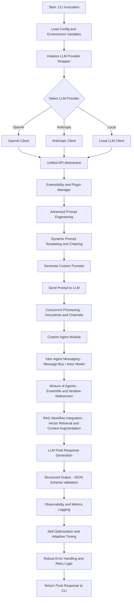

# Agentic RAG Flow

OpenAI's Agentic RAG Flow is a framework that combines retrieval-augmented generation (RAG) with agentic capabilities. This allows for the generation of responses based on both pre-existing knowledge and real-time information retrieval.

## Key Components

1. **Load the Entire Document** into the context window.
2. **Chunk the Document** into 20 chunk that respect sentence boundaries.
3. **Prompt the model** for which chunks might contain relevant information.
4. **Drill down** into the selected relevant chunks.
5. **Recursively call this function** until we reach paragraph-level content.
6. **Generate a response** based on the retrieved information.
7. **Verify the answer** for factual accuracy.

